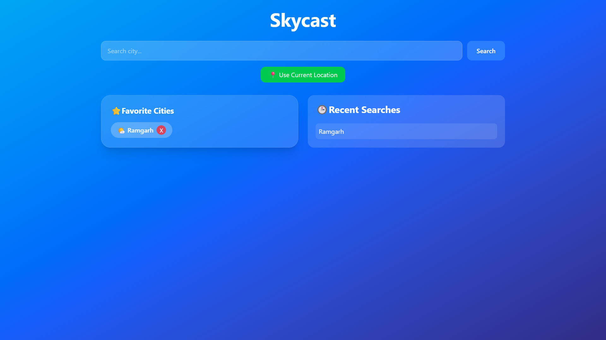
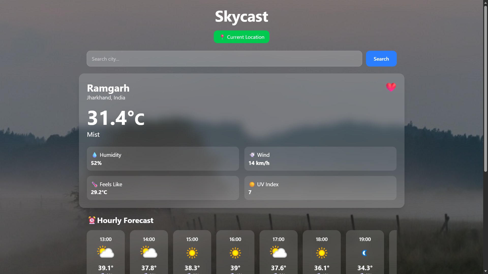
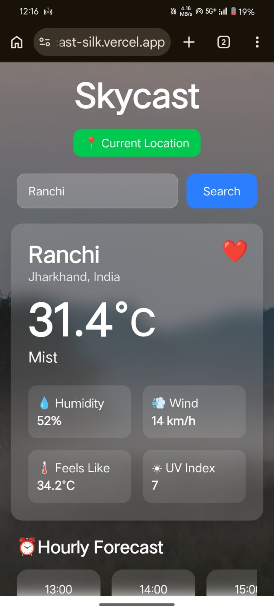

# 🌦️ SkyCast - Weather Dashboard

SkyCast is a modern weather application built using the MERN stack ecosystem. It provides real-time weather information, hourly forecasts, 5-day forecasts, geolocation-based weather updates, favorites management, recent search history, and dynamic weather-themed backgrounds.

## 🚀 Features

* 🔍 Search weather by city name
* 📍 Current location weather using Geolocation API
* 🌡️ Real-time weather data
* ⏰ Hourly weather forecast
* 📅 5-Day weather forecast
* ⭐ Save favorite cities
* 🕒 Recent search history
* 🌙 Dark mode support
* 🎨 Dynamic weather-based themes and backgrounds
* 🔔 Toast notifications
* 📱 Responsive design for mobile and desktop

## 🛠️ Tech Stack

### Frontend

* React.js
* Vite
* Tailwind CSS v4
* Axios

### Backend

* Node.js
* Express.js

### APIs

* WeatherAPI

## 📸 Screenshots

### Home Page


### Weather Dashboard


### Mobile View


## ⚙️ Installation

### Clone Repository

```bash
git clone https://github.com/Adityasah-7091/skycast.git
cd skycast
```

### Backend Setup

```bash
cd backend
npm install
npm start
```

### Frontend Setup

```bash
cd frontend
npm install
npm run dev
```

## 🔑 Environment Variables

Create a `.env` file inside the backend directory:

```env
API_KEY=YOUR_WEATHERAPI_KEY
```

## 🌐 Live Demo

[Live Demo](https://skycast-silk.vercel.app/)

## 📚 What I Learned

* Building full-stack applications with React and Express
* API integration and data handling
* Responsive UI design with Tailwind CSS
* State management in React
* Local storage management
* Deployment using Vercel

## 👨‍💻 Author

Aditya Kumar Sah
